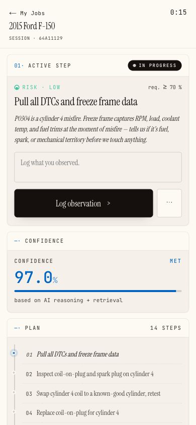
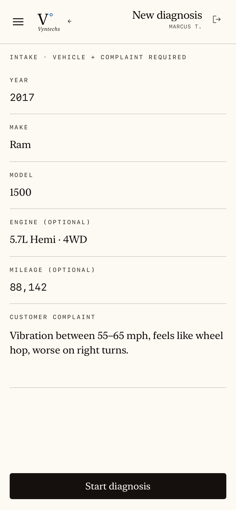
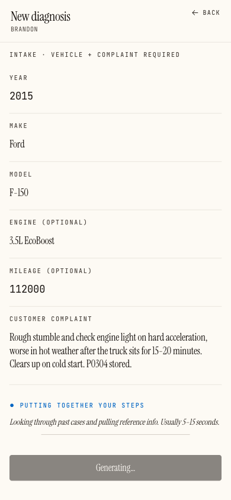
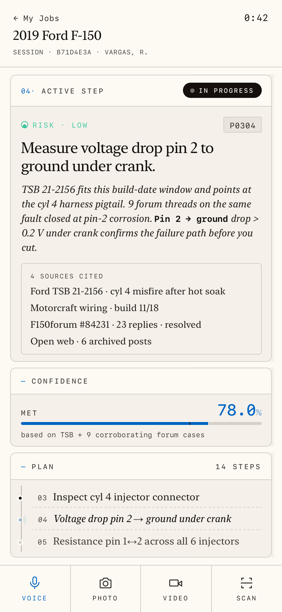
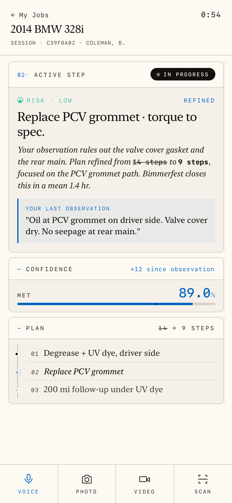
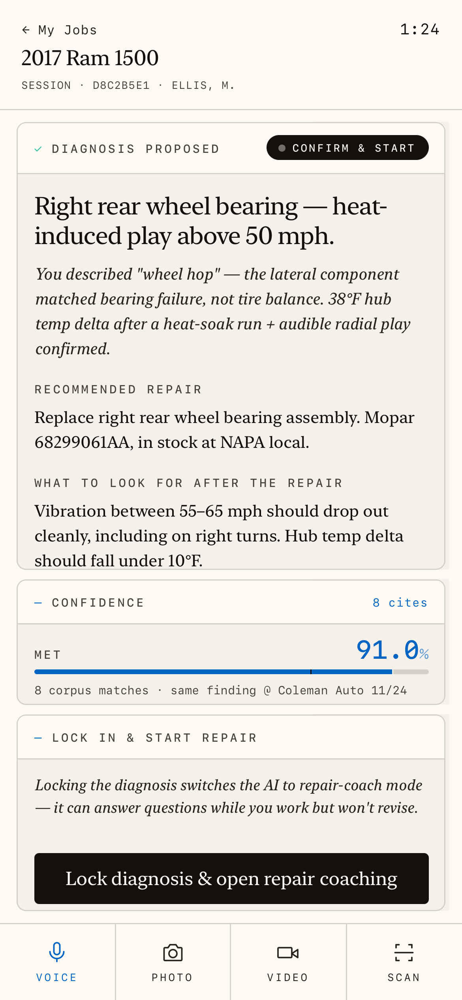

# VynTechs_Auto

An AI diagnostic copilot for the auto repair bay. A tech enters a vehicle and a complaint; the system runs a stateful, evidence-grounded diagnostic — and refuses to recommend a risky action it isn't confident enough to stand behind.

Built for independent shops. Billed per shop, one subscription per tenant.

**Live in production** — used by real repair shops, with real Stripe billing and paid diagnostic sessions.

Built by a diagnostic tech, for diagnostic shops. I didn't go to college — I went under cars. Diagnostics since 14, professionally since 2016. I know what a wrong answer costs in a real bay, so I built the tool to measure its own confidence before it ever opens its mouth.

<p align="center">
  
</p>

## The problem

A misdiagnosis isn't a wrong answer. It's a customer who pays for the wrong part, comes back angry, and never trusts the shop again — a comeback.

Most "AI mechanic" tools are a chatbot with a service manual stapled on. They sound confident and guess. This one is built the other way around: confidence is measured, risk is classified, and the system would rather ask for one more reading than tell a tech to cut a wire on a hunch. The safety floor is code, not vibes.

## Architecture

The core is a stateful decision-tree engine, not a single prompt. Every turn pulls evidence, advances the tree, and gates the proposed action against a calibrated confidence threshold before the tech ever sees it.

```
                        TECH: vehicle + complaint
                                  │
                    ┌─────────────▼─────────────┐
                    │   Two-rung retrieval        │  ← bounded by a 20s deadline,
                    │   (parallel, fail-soft)     │    never blocks the LLM call
                    │                             │
                    │  Rung 0  cross-shop corpus  │  pgvector cosine KNN
                    │          (Voyage voyage-3,  │  founder-verified cases
                    │           1024-dim)         │  get a top-2 fast lane
                    │                             │
                    │  Rung 1  6 internet adapters│  nhtsa .90 · recall .85
                    │          weighted + budgeted│  forum .60 · youtube .55
                    │                             │  reddit .50 · web .50
                    └─────────────┬───────────────┘
                                  │  snippets graded by an LLM
                                  │  (keep only relevance ≥ 0.4)
                    ┌─────────────▼───────────────┐
                    │   Tree engine (Sonnet)      │  generate / update tree,
                    │   forced JSON, brace-        │  emit a proposedAction
                    │   recovery + shape validation│  with confidence 0–1
                    └─────────────┬───────────────┘
                                  │
                    ┌─────────────▼───────────────┐
                    │   Risk + confidence gate    │  classify action:
                    │                             │  zero / low / medium /
                    │   ~15 regex rules FIRST      │  high / destructive
                    │   (Haiku only if no rule     │  destructive (cut wire,
                    │    matches; default = HIGH   │  reflash) matched first,
                    │    on any failure)          │  can't be downgraded
                    └─────────────┬───────────────┘
                                  │
              confidence ≥ threshold?  ──── no ──▶  block · offer
                                  │                 [gather more low-risk · defer]
                                 yes                + show what would close the gap
                                  │
                    ┌─────────────▼───────────────┐
                    │  Repair phase (Sonnet)      │  root cause is LOCKED;
                    │  guidance only — server      │  output field-stripped to
                    │  guard drops any field that  │  {text, tangentialConcerns}
                    │  could re-diagnose          │  so it can't be hijacked
                    └─────────────────────────────┘
```

### The AI pipeline

- **One LLM provider, two tiers.** A single Anthropic client. `claude-sonnet-4-6` (overridable via `ANTHROPIC_MODEL`) does the heavy reasoning — tree generation, vision extraction, retrieval grading, repair guidance, outcome validation. `claude-haiku-4-5` is used in exactly one place: the fallback risk classifier. No Opus tier — the work doesn't need it.
- **Rules first, LLM second.** The risk classifier runs ~15 regex rules before it ever calls a model. Destructive actions — cut/splice a wire, reflash an ECU — are matched first so they can never be quietly downgraded. If a rule matches, no LLM runs. If the model is called and returns malformed JSON, the action defaults to `high`. Safety bias is the default, not the exception.
- **Confidence is calibrated, not asserted.** Thresholds live per `(risk class × vehicle family × symptom class)` cell, most-specific-cell wins, with a hard fallback (`zero 0 · low .70 · medium .80 · high .90 · destructive .95`). A weekly Beta-Binomial refit watches each cell's comeback rate and proposes a nudge — but it's **advisory**. Drift only writes an alert for a human curator when it clears `0.05` with a sample of `10+`. The threshold table is read-only to the job, and the refit is clamped to `[0.5, 0.99]` so the safety floor can never be turned off.
- **Vision is earned, not default.** Four Sonnet vision extractors read scan screens (DTCs, freeze-frame, PIDs), wiring diagrams (wire colors, pins, grounds, splices), and steered generic photos. The tree prompt is told *not* to ask for photos by default — vision is expensive, text confirms are cheap. Video is stored describe-first, no extraction. (Audio transcription is a known stub: the SDK has no native audio block yet, so that path is documented as API-pending, not silently broken.)
- **The corpus self-curates.** Closed cases can be promoted into a cross-shop corpus. Each entry's confidence is roughly `successes / (successes + comebacks)` (Laplace-smoothed, capped at 0.99). Comebacks decay it; an entry with `3+` comebacks that outnumber its successes auto-retires. Shop-owner-verified cases are tagged as the highest source of truth and jump the queue.

### Data, auth, billing

- **Multi-tenant by shop.** `shops → profiles → customers → vehicles → sessions`, on Drizzle over postgres-js (not the Supabase client) with `prepare: false` for the pooler. Sessions carry typed JSONB — intake, tree state, outcome — and an append-only `session_events` audit log captures every AI turn.
- **Closed-by-default paywall.** Node-runtime middleware refreshes the Supabase session, role-gates `/curator/*`, then enforces access against an exempt allowlist. API routes get a JSON 401/403; pages redirect. The same check ships *inside* the API handlers as defense-in-depth against a curl bypass.
- **Two independent access axes.** A `role` column (`tech`/`owner`) for the shop, and a separate curator/founder gate (`isCurator` flag or matched founder email). The role column is deliberately *not* used for curator access — every self-signup is an owner, and that would otherwise hand everyone the keys.
- **Stripe, per shop.** One customer per tenant, Checkout + Billing Portal, signature-verified webhooks that write back only subscription status and period end. No usage metering, no per-seat math — one subscription per shop.
- **Knowledge graph.** A normalized electrical-topology model (platforms, components, pins, connections, scenarios, readings) sits alongside the corpus, every node carrying source provenance (`TRAINING-CONFIRMED` / `FIELD-VERIFIED` / `GAP`) and an inference class (`LAW` / `LOGIC` / `PATTERN`).

## The flow

One diagnostic, five steps — open the case, pull the evidence, propose the next test, confirm the reading, lock the root cause. Same loop as the diagram above, in the tech's hands.

<p align="center">
  
  
  
  
  
</p>

## How it's built

This is AI-directed, human-verified work. I direct the agents; I own the judgment and the verification. The architecture decisions, the safety doctrine — rules before LLMs, advisory-not-automatic calibration, locked diagnoses — are mine, and they're enforced in the code and the convention docs. The line-by-line authoring is paired with Claude, credited in the commit trailers. I don't claim I hand-wrote every line. I claim I know exactly why every line is there — and I can show you the test that proves it.

## What this is — and isn't

This is the real production app, shared to show how I work — not a drop-in template you can point at your own shop and run. Some paths are honest stubs: audio transcription is documented as API-pending, not silently broken. The calibration refit is advisory by design — it proposes a threshold nudge for a human to approve; it never moves the safety floor on its own. Still learning, still building. I'd rather show you the limit than hide it.

## Scale, plainly

- **300+ commits** over roughly eight weeks of focused work.
- **~64k lines** of TypeScript outside `node_modules`; `lib/` alone spans 15 domain subdirectories.
- **184 unit test files**, 1,300+ test blocks under Vitest, backed by an in-memory Postgres (pglite) so handlers test against real SQL without mocking the framework. Plus Playwright e2e specs.
- **38 Postgres tables**, 27 versioned migrations, a daily backup workflow, two scheduled cron jobs.
- An enforced convention: every API route is a thin ~30-line shim that delegates to a `lib/` handler taking `db` as its first argument — which is *why* the logic is testable against real Postgres without mocking Next.js.

## Stack

Next.js 16 (App Router, Node runtime) · React 19 · TypeScript · Drizzle ORM over postgres-js · Supabase (auth, Postgres, Storage) · pgvector + Voyage AI `voyage-3` embeddings · Anthropic SDK (`claude-sonnet-4-6` / `claude-haiku-4-5`) with ephemeral prompt caching on every static system prompt · Stripe · Zod · `@xyflow/react` + dagre for the topology diagrams · Vitest + Playwright.

## Run

```bash
pnpm install
cp .env.example .env.local   # fill in Supabase, Anthropic, Voyage, Stripe, CRON_SECRET
pnpm dev
pnpm test                    # Vitest, pglite-backed
```

Migrations are applied to live Supabase through its own migration history (the Drizzle filenames are kept for source control). Deploys run on Vercel; the two cron jobs (`comeback-prompts-daily`, `calibration-weekly`) are wired in `vercel.json` and gated by a constant-time `CRON_SECRET` check.
